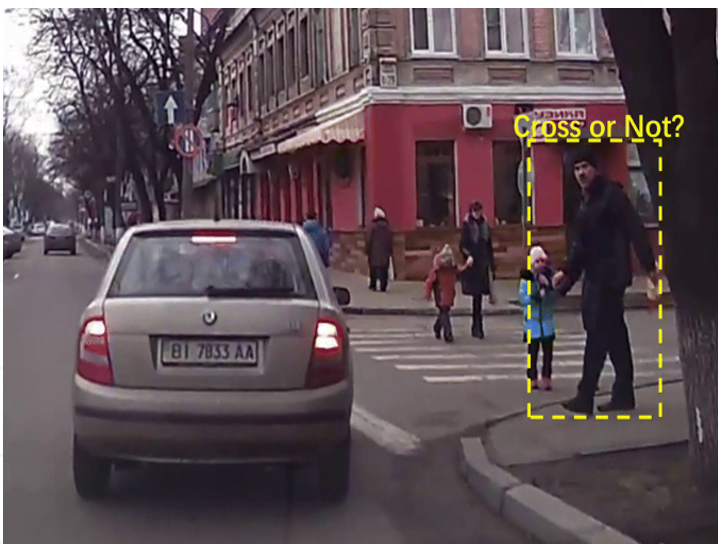

<p align="center">
  
</p>

# PedVLM-Flow: Enhancing Pedestrian Crossing Intention with Dual-Stream Vision and Optical Flow

A vision-language model for pedestrian crossing behavior detection using the JAAD dataset. Combines a dual-stream vision encoder (CLIP + flow CNN), T5 text embeddings, and temporal attention to classify whether a pedestrian is crossing or not crossing the road.

## Pipeline Steps

1. **Environment Setup** — Creates output directories, enumerates videos
2. **Annotation Parsing** — Reads JAAD XML, extracts `cross` attribute per frame
3. **Clip Extraction** — Slides over videos (30-frame clips), computes Farneback optical flow and motion magnitude
4. **Label Refinement** — Combines annotation labels with motion-based heuristics to correct mislabeled clips
5. **Data Augmentation** — ReplayCompose (flip, brightness, blur, noise, gamma, hue) applied to minority (crossing) class
6. **Dataset** — `EnhancedPedestrianDataset` with dynamic prompt augmentation
7. **Model** — `EnhancedPedVLM`: CLIP + T5 + flow CNN + temporal attention + fusion MLP
8. **Training** — AdamW with per-module LR, focal loss + weighted CE, ReduceLROnPlateau, early stopping
9. **Evaluation** — Accuracy, macro/micro/weighted F1, AUC, confusion matrix, PR curve, per-class analysis

## Usage

```python
from pedvlm_flow import main_enhanced_pipeline

results = main_enhanced_pipeline(
    base_path="/path/to/JAAD_2",
    extract_stride=10,
    batch_size=8,
    epochs=15,
    val_split=0.2
)
```

Or run the notebook cells in order.

## Results

| Split      | Accuracy | Macro F1 | AUC   |
|------------|----------|----------|-------|
| Validation | 97.2%    | 0.966    | 0.994 |
| Test       | 90.0%    | 0.863    | 0.970 |

## Requirements

- Python 3.10+
- PyTorch, torchvision
- Transformers (CLIP, T5)
- OpenCV, Albumentations
- scikit-learn, seaborn, matplotlib, tqdm

## License

This project is provided for academic and research purposes only. No formal license is applied; all rights reserved.

## Author

**Amad Uddin Ezaz** — Research project for pedestrian crossing behavior detection using multimodal vision-language models.

## Research Paper

Amad Uddin Ezaz. *PedVLM-Flow: Enhancing Pedestrian Crossing Intention Prediction with Dual-Stream Vision and Optical Flow.*  
Available at: [https://www.researchgate.net/publication/404608615_PedVLM-Flow_Enhancing_Pedestrian_Crossing_Intention_Prediction_with_Dual-Stream_Vision_and_Optical_Flow](https://www.researchgate.net/publication/404608615_PedVLM-Flow_Enhancing_Pedestrian_Crossing_Intention_Prediction_with_Dual-Stream_Vision_and_Optical_Flow)

## Citation

If using this work, please cite:

```
@article{uddin2025pedvlmflow,
  title={PedVLM-Flow: Enhancing Pedestrian Crossing Intention Prediction with Dual-Stream Vision and Optical Flow},
  author={Uddin, Amad and Ezaz},
  year={2025}
}
```

If using the JAAD dataset: I. Kotseruba, et al., "JAAD: Joint Attention for Autonomous Driving," IEEE IV 2016.
